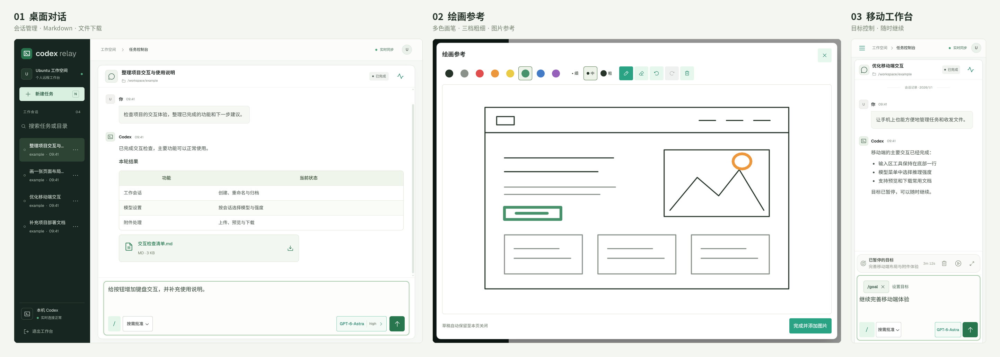

[简体中文](README.md) | **[English](README.en.md)**

# Codex Relay — Your Codex workspace across devices

<p align="center">
  <picture>
    <source media="(prefers-color-scheme: dark)" srcset="docs/images/readme-banner-dark.svg">
    
  </picture>
</p>

<p align="center">
  
</p>

**Bring your local Codex to the browser and continue the same work on your computer, tablet, or phone.**

Codex Relay is a self-hosted web workspace that uses your local Codex CLI to manage sessions, run tasks, handle approvals, and exchange files. It uses your own Codex account, model provider, and skill configuration, with tasks managed by the service running on your server.

<p align="center">
  <a href="#quick-start">Quick start</a> ·
  <a href="#features">Features</a> ·
  <a href="docs/usage.md">Usage</a> ·
  <a href="docs/configuration.md">Configuration</a> ·
  <a href="docs/deployment.md">Deployment</a> ·
  <a href="docs/deployment.md#常见问题">Troubleshooting</a>
</p>

<p align="center">
  <a href="docs/images/interface-overview.png">
    
  </a>
  <br>
  <sub>The actual interface with demo data. Click the image to enlarge.</sub>
</p>

This README is available in English. The interface, management messages, and linked detailed guides are currently in Simplified Chinese.

## Quick start

**Linux / WSL2** is recommended. You need Python **3.11+** with venv support, Node.js **22 / 24**, npm, and a Codex CLI installation that is already signed in or configured for your model provider. The currently verified CLI version is **0.154.0**. The first installation needs access to PyPI and the npm registry.

Download and extract this repository using **Code → Download ZIP**, or use `git clone` with the URL shown under Code. Enter the project root, where you can see `scripts/` and `relay.example.toml`, and run:

```bash
bash scripts/relay.sh start
```

The manager checks Python, Node, and Codex, installs missing project dependencies from the lockfiles, builds the frontend, and creates a user systemd service. If user systemd is unavailable, it runs in the foreground. Existing configuration and data are preserved; a missing `relay.toml` is created from the example. If system dependencies are missing, the manager prints installation guidance without running sudo automatically.

The default model choices are `gpt-5.6-sol` and `gpt-6-astra`. Your model provider must support them; otherwise, update `models` and `default_model` under `[ui]`. Before starting, you can also copy `relay.example.toml` to `relay.toml` to configure working directories, models, and the listening address. Edit an existing configuration file directly. See the [configuration reference](docs/configuration.md) for all options.

**Switching API providers:** [CC Switch CLI](https://github.com/SaladDay/cc-switch-cli) lets you manage and switch API provider configurations for tools such as Codex and Claude Code from the terminal. It can be useful if you regularly switch between multiple providers.

Check the service status, or choose to run in the foreground:

```bash
bash scripts/relay.sh status
# When no background service is running:
bash scripts/relay.sh start --foreground
```

Open **http://127.0.0.1:8000**. In another terminal, read the login password generated on the first start:

```bash
cat runtime/access.txt
```

After signing in, select an existing session or click **新建任务** (New task) to browse your working directories and begin. If you use a custom data directory, read `access.txt` from that directory instead. See the [deployment guide](docs/deployment.md) for remote access and persistent service operation.

### Service management and directory migration

| Command | Purpose |
| --- | --- |
| `bash scripts/relay.sh start` | Check and start the service; repeated calls do not restart it when configuration and dependencies are unchanged |
| `bash scripts/relay.sh repair` | Repair outdated paths, a broken virtual environment, or the frontend build, then restore service operation |
| `bash scripts/relay.sh stop` | Stop the service belonging to the current project |
| `bash scripts/relay.sh restart` | Check the environment and restart the service |
| `bash scripts/relay.sh status` | Show the process, paths, dependencies, frontend status, and access addresses |
| `bash scripts/relay.sh logs` | Show installation logs and follow service logs; press Ctrl+C to stop viewing |

After renaming or moving the project, run `bash scripts/relay.sh repair` in the **new directory**. Paths containing Chinese characters or spaces are supported, and you can invoke the script by its full path from another working directory. Before moving the project, wait for tasks to finish, resolve any queued messages, and run `stop`. Move `relay.toml`, `runtime/`, and any custom runtime data along with the project. The manager refuses maintenance operations when it finds running tasks or pending queues; it does not forcibly interrupt them.

Repair backs up configuration and generated files before replacing them, and recreates invalid virtual environments. If installation or building fails, it restores the previous files. It reports an error when old path information conflicts, the original directory still exists, or a service with the same name belongs to another project. Working directories and external file paths stored in native Codex sessions are not rewritten. See [backup and migration](docs/deployment.md#备份和迁移) for the scope of migration and backup locations.

To enable automatic startup, explicitly run `bash scripts/relay.sh start --enable`. To install without starting the service, use `bash scripts/setup.sh`; use `bash scripts/setup.sh --dev` to include development dependencies.

### Access through a public IP address or domain

The default address, `127.0.0.1`, accepts connections only from the server itself. To connect directly from another device, edit the existing `[server]` section in your local `relay.toml`. Do not add a duplicate section:

```toml
[server]
host = "0.0.0.0"
port = 8000
secure_cookie = false # Use false for direct HTTP access.
```

Then run `bash scripts/relay.sh restart`. The manager checks for active tasks and queued messages before restarting. If dependencies are already installed, you can also start a temporary instance manually for testing:

```bash
.venv/bin/python -m server --host 0.0.0.0 --port 8000
```

`0.0.0.0` means listening on all IPv4 interfaces. In your browser, open `http://YOUR_PUBLIC_IP:8000/` or `http://YOUR_DOMAIN:8000/`. The domain's A record must point to the server's public IP address, and both the cloud security group and the host firewall must allow inbound TCP port 8000. Cloud servers often receive public traffic through a private network interface, so you do not need to put the public IP address in `host`.

Direct HTTP access is useful for connectivity testing. For ongoing public access, configure an [HTTPS reverse proxy](docs/deployment.md#nginx-和-https), set the backend to `host = "127.0.0.1"`, and use `secure_cookie = true`. Keep the Cookie setting consistent with the browser's connection protocol, or the browser may be unable to retain the login session.

If you remain on the login page after entering the password, check `secure_cookie` against the connection protocol and read any Cookie-related message on the page. See [login troubleshooting](docs/deployment.md#登录排查). The login password is the content of `runtime/access.txt`, not your model provider's API token. Git ignores the local `relay.toml`; contribute deployment documentation through the README and `relay.example.toml` instead.

## Features

- **Sessions across devices** — Use the same workspace on computers, tablets, and phones. Browse real directories and create, rename, or archive sessions.
- **Persistent goals** — Use `/goal` to keep working toward an objective, then edit, pause, resume, or clear it above the message composer.
- **Models and permissions** — Choose a model and reasoning effort per session, respond to approvals and questions in the conversation, and stop a running response.
- **Files and sketches** — Upload and receive images, PDFs, Office documents, and other supported files. Draw on a multicolor canvas and attach the sketch as an image reference.
- **Readable conversations** — Render Markdown tables, math, and separate command blocks. The latest 10 records load by default; scroll up to view the full history.
- **Live task status** — Messages and task activity stay synchronized. Open execution details when needed and queue follow-up messages while a task is running.

## Common commands

Ordinary messages run directly by default. You can also select a command from the `/` menu in the composer.

| Command | Purpose |
| --- | --- |
| `/goal objective` | Set a persistent goal and manage it through the goal bar |
| `/plan request` | Enter plan mode to plan the task first |
| `/default` | Return to execution mode |
| `/compact` | Compact the native context while preserving web chat history |
| `/model`, `/permissions` | Open the model or permission selector |
| `/status`, `/help` | View execution details or the full command list |

`/goal` manages persistent goals; `/plan` enables plan mode. Only complete command names trigger commands. Paths such as `/tmp/report.pdf` and `/goal/report.md` can be sent as ordinary text. See the [usage guide](docs/usage.md) for details.

## Architecture and deployment

The React interface connects to a FastAPI service over HTTP and SSE. The service calls the local Codex CLI. Task execution, tools, and access to model providers use your Codex configuration. A persistent service can continue managing tasks after you close the browser.

Configure working directories, models, and the listening address in your local `relay.toml` ([example configuration](relay.example.toml)); environment variables can override file settings. The service listens locally by default. Use HTTPS for remote access; the [deployment guide](docs/deployment.md) includes systemd and Nginx examples. Uploading, previewing, and sketching images do not require an image generation API. Generating new images requires the appropriate skills or tools in your own Codex setup.

An instance shares the server user's sessions and filesystem permissions. It is intended for personal use or trusted teams and runs as a single process. Account credentials, local configuration, and runtime data are not part of the source distribution. See the [security notes](SECURITY.md) for the trust boundary and deployment guidance.

## Documentation

The detailed guides below are currently in Simplified Chinese.

| What you want to do | Start here |
| --- | --- |
| Manage sessions, goals, approvals, and attachments | [Usage guide](docs/usage.md) |
| Change models, working directories, or listening settings | [Configuration reference](docs/configuration.md) · [Example configuration](relay.example.toml) |
| Set up HTTPS, a persistent service, or data migration | [Deployment and troubleshooting](docs/deployment.md) |
| Understand the project structure and Codex integration | [Architecture](docs/architecture.md) |
| Develop locally, run tests, and contribute | [Development guide](docs/development.md) · [Contributing](CONTRIBUTING.md) |
| Understand security boundaries and version changes | [Security notes](SECURITY.md) · [Changelog](CHANGELOG.md) |
| Review privacy, build source archives, and prepare releases | [Maintenance and releases](docs/releasing.md) |

The current source version is **1.1.0**. Installation and browser acceptance tests use isolated demo data; the source distribution does not include the maintainer's accounts, server configuration, sessions, or attachments. Codex CLI uses an experimental protocol. After upgrading the CLI or switching providers, run the [integration checks](docs/development.md#原生-codex-接入检查). This is a community-maintained project with no official affiliation with OpenAI.

## License

[MIT](LICENSE).
